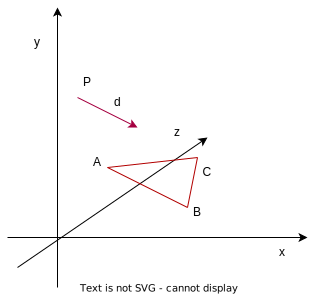

# The ray-triangle intersection problem

点pの方向が
$$ \bm{d} : 点pの方向$$
で与えられる。点Pが三角形ABCにぶつかるかどうか

## 数式化

Pの先

$$ \bm{R} = \bm{P} + t \bm{d}, t \ge 0 $$

平面上の点は非直交正規基底（nonorthonormal linear basis）に配置できる事を使う。

直交正規基底：（1,0,0), (0,1,0),(0,0,1)

三角形の表現

$$ \bm{S} = \bm{A} + u \bm{AB} + v \bm{AC} $$

